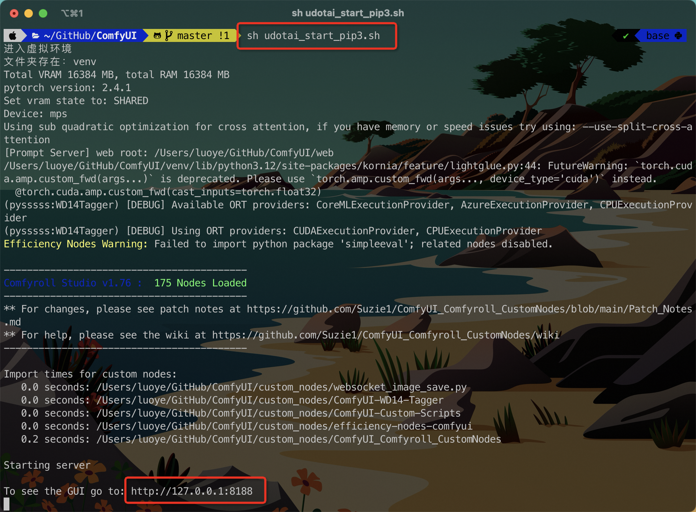

<div align="center">

# ComfyUI - 悠点绘专版
**本项目Fork自ComfyUI官方库，添加了`悠点绘`所需的节点和功能。**

</div>

### [悠点绘](https://app.udotai.cn)

## 环境依赖

- python3.10+

## 初始化项目环境

windows环境，自动化脚本操作：

```shell
# 自动化初始化
.\udotai_init.bat
```

macOS环境，自动化脚本操作：

```shell
# 自动化初始化
sh udotai_init.sh
# 多Python版本
sh udotai_init_pip3.sh
```

## 开启服务

使用开始脚本开启服务。

window使用脚本`udotai_start.bat`，双击运行即可开启服务。

> 如果未安装显卡驱动，无法使用CUDA，可以使用 `udotai_start_cpu.bat` 使用CPU启动。

Mac使用脚本`udotai_start.sh`，在终端运行即可开启服务。



## 下载模型

生图模型需要自行下载，并放在`modules/checkpoints`目录下。

Lora模型需要放在`modules/lora`目录下。

Vae模型需要放在`modules/vae`目录下。

放大模型需要放在`modules/upscale_models`目录下。

### 模型下载地址

可根据自行需要下载使用的模型和Lora，以下只做推荐，可自行寻找免费模型替换使用。

### 生图模型

- [小说推文-都市言情-动漫-二次元](https://www.liblib.art/modelinfo/e2d55c3aa78f488d900098026ea3dd28?from=search)
- [菜里有毒_小说推文：都市言情繁花似锦SD1.5](https://www.liblib.art/modelinfo/b890705d5092497aafe7dc1c0d935ead?from=search)
- [古风小说推文人设](https://www.liblib.art/modelinfo/e1bc7a018d3e4a8d9531fa4ab48ab37b?from=search)
- [1.5_悬疑小说推文模型](https://www.liblib.art/modelinfo/71b5dafe1f7e4be083a507b76a20d319?from=search)
- [AgainMixChildrens儿童绘本](https://www.liblib.art/modelinfo/76d87b20c55748839375dbb42374db2c?from=search)
- [儿童绘本插画MOMO](https://www.liblib.art/modelinfo/53793f6bb8a84b609423f1a66b1ea9f1?from=search)
- [儿童插画绘本Minimalism](https://www.liblib.art/modelinfo/8b4b7eb6aa2c480bbe65ca3d4625632d?from=search)
- [儿童绘本CUTE](https://www.liblib.art/modelinfo/225479f9bdff4a2db197a8f48c807930?from=feed)

### Lora

- [niji风格都市言情小说推文](https://www.liblib.art/modelinfo/dccf69005b1740b299a7aea47e9b5ac7?from=search)
- [儿童绘本卡通插画丨CJ_illustration](https://www.liblib.art/modelinfo/e5408ebbde2e49f4959aa9e931c72037?from=search)
- [可爱儿童绘本插画 | Children's book](https://www.liblib.art/modelinfo/04fe03eb3799448da537e7612fa99817?from=search)
- [儿童绘本 | CrayonPaiting](https://www.liblib.art/modelinfo/adb67641ff8c4f0cb184d63a998bc52e?from=search)
- [绘本风插画](https://www.liblib.art/modelinfo/520b029635c24deda4809c49dc0efbf1?from=feed)

### Vae

- [vae-ft-mse-840000-ema-pruned](https://cdn-lfs-us-1.hf-mirror.com/repos/87/85/8785cc3b994fb70b05c09a9b0b12fdf51883d096cd17bcc268d3ddd437459ce5/735e4c3a447a3255760d7f86845f09f937809baa529c17370d83e4c3758f3c75?response-content-disposition=attachment%3B+filename*%3DUTF-8%27%27vae-ft-mse-840000-ema-pruned.safetensors%3B+filename%3D%22vae-ft-mse-840000-ema-pruned.safetensors%22%3B&Expires=1726550400&Policy=eyJTdGF0ZW1lbnQiOlt7IkNvbmRpdGlvbiI6eyJEYXRlTGVzc1RoYW4iOnsiQVdTOkVwb2NoVGltZSI6MTcyNjU1MDQwMH19LCJSZXNvdXJjZSI6Imh0dHBzOi8vY2RuLWxmcy11cy0xLmh1Z2dpbmdmYWNlLmNvL3JlcG9zLzg3Lzg1Lzg3ODVjYzNiOTk0ZmI3MGIwNWMwOWE5YjBiMTJmZGY1MTg4M2QwOTZjZDE3YmNjMjY4ZDNkZGQ0Mzc0NTljZTUvNzM1ZTRjM2E0NDdhMzI1NTc2MGQ3Zjg2ODQ1ZjA5ZjkzNzgwOWJhYTUyOWMxNzM3MGQ4M2U0YzM3NThmM2M3NT9yZXNwb25zZS1jb250ZW50LWRpc3Bvc2l0aW9uPSoifV19&Signature=bUMWkex0f9iPYrV1rqkUURk8o3AHCRMbX1tzngUm3SxPacrmsY5Rh4mBkDeVgWDR08RceyggzjCeav9WA-UKcv6q4Jlf7TKeG8YdMF2VL9B%7EMVZ9p0zcQnxFapGrPNxqxwx1PskfQ5j9iigi9FpkkCRIr0fOPXKtZZ-0dcHZ3Gox5ojQQuv3%7EDxwMI89dM5L4mWV7gG765atfEYpDmGejR2ZGeQoCyspnhj49WwOXw176yUDfPq78Uuk%7E6%7EFKS%7E8bZ88wZ7LA3F-Llw8IrVMMBPm1OVaybh9zyzMr6siM3aozAwHNS8rejfjVJHE62fVEBwGhOPPQaA%7EKXNVVbDSaA__&Key-Pair-Id=K24J24Z295AEI9)


### 放大模型

- [RealESRGAN_x4plus_anime_6B](https://cdn-lfs.hf-mirror.com/repos/b3/11/b311255678d0743dc6d549a042599d1c034aeb7d449871ac0c621b2c1562893f/f872d837d3c90ed2e05227bed711af5671a6fd1c9f7d7e91c911a61f155e99da?response-content-disposition=attachment%3B+filename*%3DUTF-8%27%27RealESRGAN_x4plus_anime_6B.pth%3B+filename%3D%22RealESRGAN_x4plus_anime_6B.pth%22%3B&Expires=1726551309&Policy=eyJTdGF0ZW1lbnQiOlt7IkNvbmRpdGlvbiI6eyJEYXRlTGVzc1RoYW4iOnsiQVdTOkVwb2NoVGltZSI6MTcyNjU1MTMwOX19LCJSZXNvdXJjZSI6Imh0dHBzOi8vY2RuLWxmcy5odWdnaW5nZmFjZS5jby9yZXBvcy9iMy8xMS9iMzExMjU1Njc4ZDA3NDNkYzZkNTQ5YTA0MjU5OWQxYzAzNGFlYjdkNDQ5ODcxYWMwYzYyMWIyYzE1NjI4OTNmL2Y4NzJkODM3ZDNjOTBlZDJlMDUyMjdiZWQ3MTFhZjU2NzFhNmZkMWM5ZjdkN2U5MWM5MTFhNjFmMTU1ZTk5ZGE%7EcmVzcG9uc2UtY29udGVudC1kaXNwb3NpdGlvbj0qIn1dfQ__&Signature=ISSptW%7Ej0vHA6LC9yDwEUeJFuZZNRZ4WLB3RaZ4CYN%7EeaTiGPBBB2DpOb5dSUd9-tptqnB3zs%7Equ5A8dC41wIM7dPzwVNo86IZ4tv5XOBZPxdYowenTVEA6mVOO6fEQzyC1o9zAHET3DUqBL5YCt17uKQiSOr4MI18tat39OIbPsFK2LmvfuWS52lMYYwlSatCxEveoP3Iqh6iZf%7EI1O-q%7EcnWDN0BkRLH%7E9pl9bAXQQmvcdDYFwRhgp7WxjDjnh3Eev-zPpxVPyuFeTdieA0LF2%7ETBRPNOlnkLFICLya8lnS%7EyHaPZvZLrGFebl6e2eNqaclloAju93iL%7EPBcvYuw__&Key-Pair-Id=K3ESJI6DHPFC7)